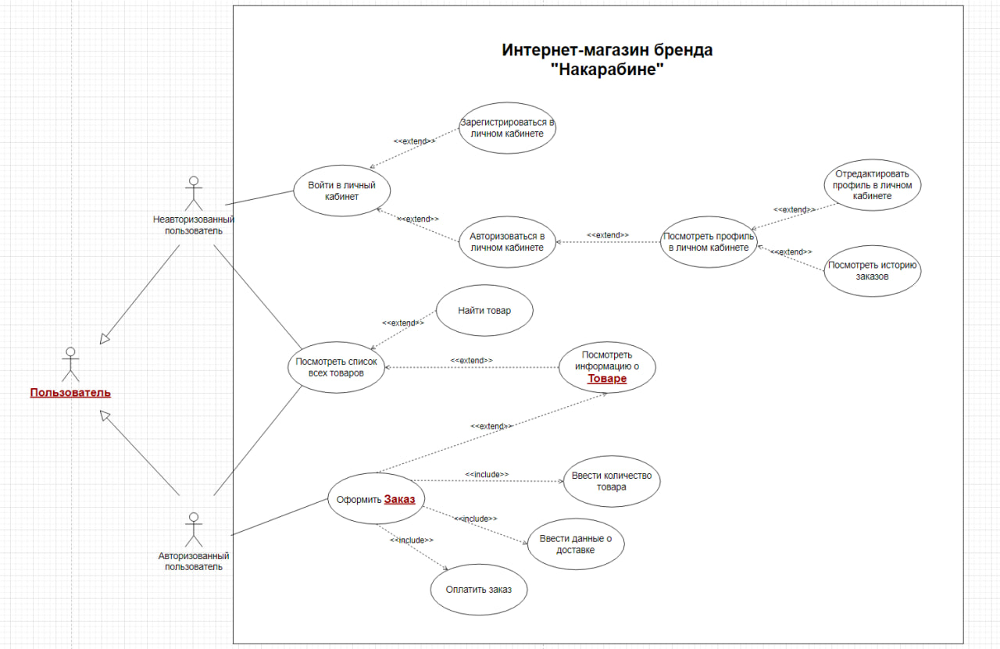
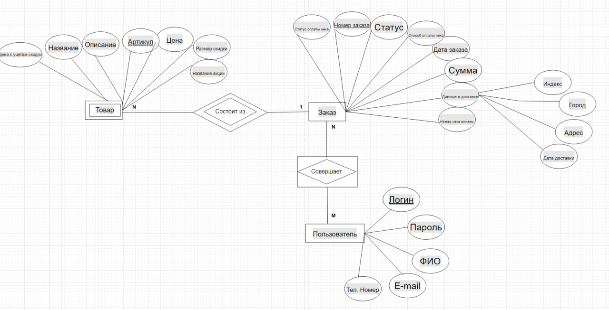
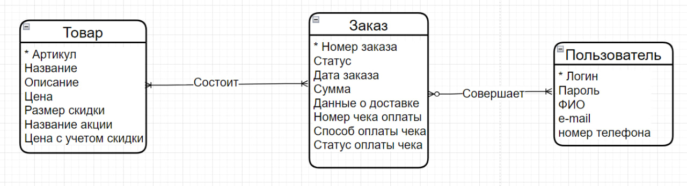
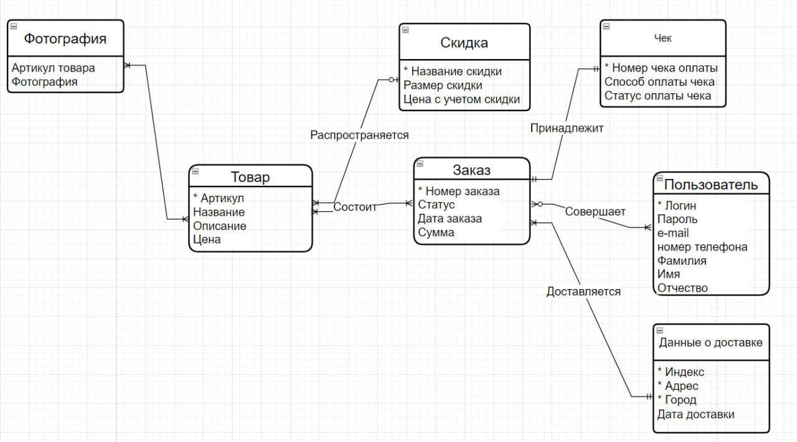

# ER-diagrams

## Задание:

1) Составить логическую ER-диаграмму в нотации Чена.
2) Составить логическую ER-диаграмму в нотации Crow’s Foot.
3) Привести логическую ER-модель к третьей нормальной форме.

### Обратите внимание на несколько важных моментов

1. В интернет-магазине продаётся одежда только одного бренда — «Накарабине».
2. Данные банковских карт пользователей храниться не будут.
3. В интернет-магазине иногда могут проходить акции с фиксированными скидками. Такие акции будут распространяться на выборочные товары. Поэтому пользователи должны видеть и старую, и новую цену. Один товар может участвовать только в одной акции.
4. В этом задании не нужно составлять словарь данных.

## Изучить Use-Case диаграмму:

## 1) Составить логическую ER-диаграмму в нотации Чена.

## 2) Составить логическую ER-диаграмму в нотации Crow’s Foot.

## 3) Привести логическую ER-модель к третьей нормальной форме.

